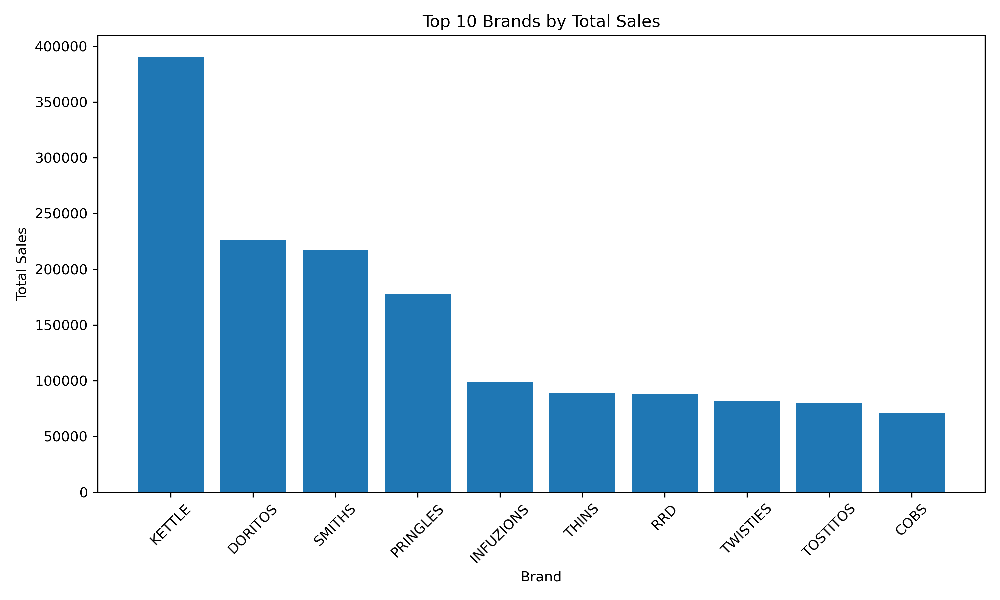
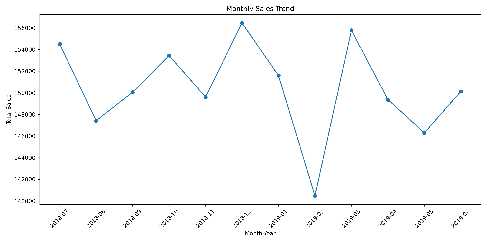

# Chips Sales Analysis

## 🎯 Objective

The goal of this project is to analyze customer purchasing behavior and identify key drivers of sales performance.

## 📊 Project Overview

This project analyzes transactional sales data to uncover trends, customer segments, and product performance.

## 🛠 Tools Used

* Python (Pandas, NumPy, Matplotlib)
* Excel

## 🔍 Key Findings

* Premium customers showed higher average spend per transaction compared to budget customers
* A small number of brands contributed the majority of total sales
* Mid-sized pack products were purchased more frequently
* Monthly sales trends showed consistent demand patterns

## 📌 Recommendation

Focus marketing strategies on high-spending customer segments and top-performing brands to maximize revenue.

## 📊 Sample Visualizations

## 📁 Files Included

* analysis.ipynb (project code)
* sample_data.xls (sample dataset)
* charts (visualizations)

## 📈 Outcome

Generated data-driven insights to support better business decisions.
